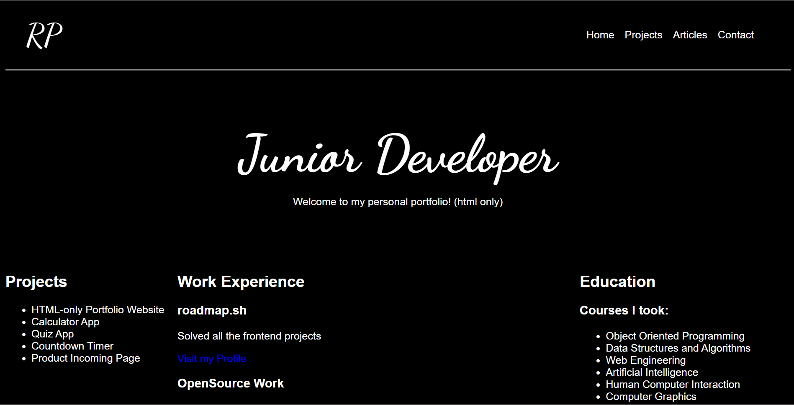

# Portfolio
A simple personal portfolio website built using HTML and CSS.  
It showcases my projects, articles, and contact information.

## Screenshot

## Features
- Simple navigation bar
- Home, Projects, Articles, and Contact pages
- Clean and simple UI design
- SEO-friendly meta tags

## Technologies Used
- HTML5
- CSS3
- Google Fonts

https://roadmap.sh/projects/basic-html-website